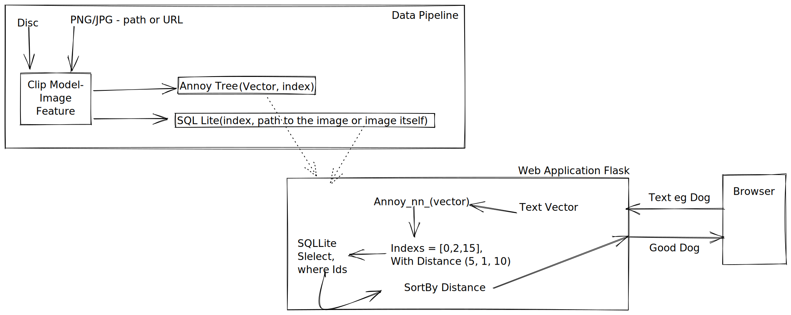

pyenv virtualenv 3.8.10 shop
pyenv activate shop
eval "$(pyenv init --path)"
pip install annoy
pip install ftfy regex tqdm
pip install git+https://github.com/openai/CLIP.git
pip install scikit-image


# boo - has to do this to get the lza working
 PYTHON_CONFIGURE_OPTS="--enable-framework" pyenv install 3.8.10

# Plan
Store all the image feature in to annoy tree and save the file on to the disk. 



## Implementation Plan
- [ ] Make sure the plan is doable MVP (in ipynb)
    - [ ] Annoy tree store and retrive
    - [ ] Image feature extraction
    - [ ] Image search is it any good?
- [ ] Back End - (Using flask)
    - [ ] API to search
    - [ ] API to upload image for search
    - [ ] API to add images to repo(may be)
- [ ] Front End - (Using boot strap)
    - [ ] Grid of images limit to 16 images a page
    - [ ] Search text box
    - [ ] Search image box 
    - [ ] Make it look like, an adult made it. 
- [ ] Deployment 
    - [ ] local server setup instructions
    - [ ] DockerFile so that it is easy to run
    - [ ] Heroku deployment (may be)


## Assumptions
- Do not send over a lager setup instructions over, it might no work.
- Should be able to run the project in 10 min. 
- Should be able feel what this project is about without having to get the whole thing running
    - Host it on heroku?
    - Make a docker image? so that it just runs (docker is everywhere?)

# Running project
1. Create database with schema from scripts folder
```
python3 scripts/create_db.py
```
# Doubts
- Not sure how well the image search is going to look like

# Why annoy 

# Auth is tricy
# Limitations
- Batch based, annoy tree cannot be updated in real time.


# Idead about scaling
Annoy has limitations
Works batchbaed, we might wan to get to real time soon
- https://milvus.io/bootcamp 
