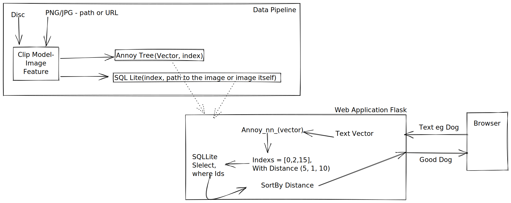

Project is Deployed [here](https://image-search-ntmld.ondigitalocean.app/)

# Search Image
Two Features are implemented in this project.
1. Search Image from text.
2. Search Image from image. or Similar Image Search.

# How it is done.
Embedding for a images in image Repository are generated and stored in annoy index.

Embeedings are generated using OpenAI's [Clip](https://github.com/openai/CLIP) pre-trained model. More details [Here](docs/semantic_search.md).

# Application Design and Data Processing
Store all the image feature in to annoy tree and save the file on to the disk. 

# Future Extensions
1. Pipeline setup to ingest hourly or daily based on amount of new images.
2. Making it scale to beyond 100,000 images. 
    - GPUs to generate embeddings in parallel.
    - A vector search engine like [Milvus](https://milvus.io)
3. Move to FastAPI from Flask making this application usable in multiple places eg mobile.
4. As the model is designed to learn from natural language and image, we can fine tune the model to learn from live data and images.

# Implementation Plan
### V1
- [x] Make sure the plan is doable MVP (in ipynb)
    - [x] Annoy tree store and retrive - done
    - [x] Image feature extraction - done
    - [x] Image search is it any good? - Good, as far as we have good amount of images indexed
- [x] Back End - (Using flask)
    - [x] API to search - Building a react app would be nice, but tome consuming. So using Flask Views
    - [x] API to upload image for search - Done
    - [X] API to add images to repo(may be) - 
            Images can be uploaded by the user to index. But index is batch based, would need be done by the user. In future we can add a airflow job to run every hour to keep the index updated. 
- [x] Front End - (Using boot strap)
    - [x] Grid of images limit to 16 images a page
    - [x] Search text box
    - [x] Search image box 
    - [ ] Make it look like, an adult made it. 
- [x] Deployment 
    - [x] local server setup instructions
    - [x] DockerFile so that it is easy to get the application running.
    - [x] Heroku deployment - deployed to digital ocean instead of heroku

### V2
- [ ] Automate index creation when new images are added to the repo.
- [ ] Use fast API to get, so that API can be used by other projects
- [ ] React App would be nice.
- [ ] Host all image assets on GCS or Digital Ocean Storage  - Will also reduce the image size.

# Goals
- Should be able to see the work, without any installation. (Deployed version)
- Should be able to run the project in 10 min. (docker or simple <5 steps)
- Should be able get a feel of what this project is about without having to get the whole thing running
    - Host it on heroku?
    - Make a docker image? so that it just runs (docker is everywhere?)

# Documentation
1. [Decision Log](docs/decision_log.md)
2. [Deployment](docs/deployment.md)
3. [Updating Annoy Search Index](docs/update_index.md)

# Development
Using Python 3.8.10 and Pyenv. Detail instructions and troubleshooting in [here](docs/development.md)