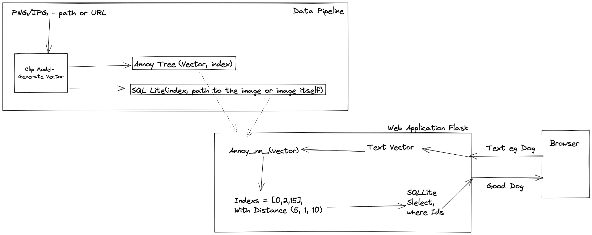

### Project is Deployed [here](https://image-search-v2-fub6y.ondigitalocean.app/)
Here are some text and images examples you can add/upload and search by
- [Salad](https://image-search-v2-fub6y.ondigitalocean.app/static/uploads/f4c0ea27.jpg)
- [Shoe](https://image-search-v2-fub6y.ondigitalocean.app/static/uploads/f9560d1e.jpg)
- [Clock](https://image-search-v2-fub6y.ondigitalocean.app/static/uploads/f40db01e.jpg)

# Search Image
Two features are implemented in this project.
1. Search Image from text.
2. Search Image from image (Similar Image Search.)

# How does it work.
Embeddings for images in the image Repository are generated and stored in the annoy index.

Embeedings are generated using OpenAI's [Clip](https://github.com/openai/CLIP) pre-trained model. More details [Here](docs/semantic_search.md).

# How to Run and Test
Project uses [pyenv](https://github.com/pyenv/pyenv) and pytest for testing.
Detail instructions and troubleshooting in [here](docs/local_dev_setup.md)

# Application Design and Data Processing
The major components and data flow of the project are as follows:

# Possible Extensions
1. Search API is designed in way it can be extracted to a REST API. Making the search API available to other applications.
2. As the model is designed to learn from natural language and image, we can fine tune the model to learn from live data and images.
3. Embedding Generation can be speeded up by using a GPU.
4. Can be scaled with the same API to server more than 100k images using vector search engine like [Milvus](https://milvus.io)

# Implementation Plan
### V1
- [x] Make sure the plan is doable MVP (in ipynb)
   - [x] Annoy tree store and retrieve - done
   - [x] Image feature extraction - done
   - [x] Image search is it any good? - Good, as far as we have a good amount of images indexed
- [x] Back End - (Using flask)
   - [x] API to search - Building a react app would be nice, but time-consuming. Consuming. So using Flask Views
   - [x] API to upload image for search - Done
   - [X] API to add images to repo(may be) - Images can be uploaded by the user to index. But index is batch based, would need be done by the user. In future we can add a airflow job to run every hour to keep the index updated.
- [x] Front End - (Using boot strap)
   - [x] Grid of images limit to 16 images a page
   - [x] Search text box
   - [x] Search image box
   - [x] Make the user experience delightful
- [x] Deployment
   - [x] local server setup instructions
   - [x] DockerFile so that it is easy to get the application running.
   - [x] Heroku deployment - deployed to digital ocean instead of heroku

### V2
- [ ] Automate index creation when new images are added to the repo.
- [ ] Use fastAPI to get, so that API can be used by other projects
- [ ] React App would be nice.
- [ ] Host all image assets on GCS or Digital Ocean Storage  - Will also reduce the image size.

# Goals
- Should be able to see the work, without any installation. (Deployed version)
- Should be able to run the project in 10 min. (docker or simple <5 steps)

# Documentation
- [Decision Log](docs/decision_log.md)
- [Deployment](docs/deployment.md)
- [Updating the Annoy Search Index](docs/update_index.md)

